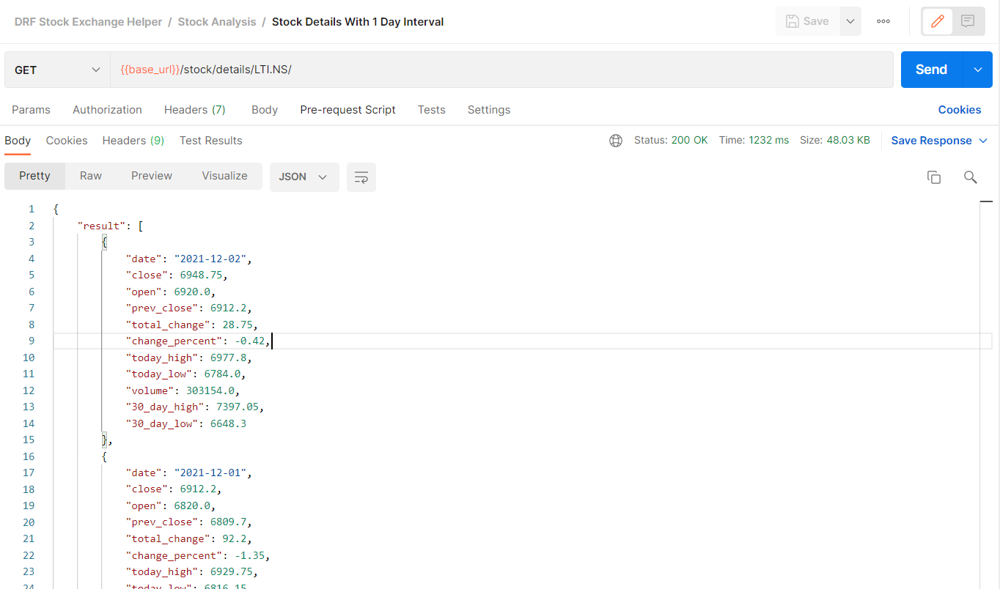
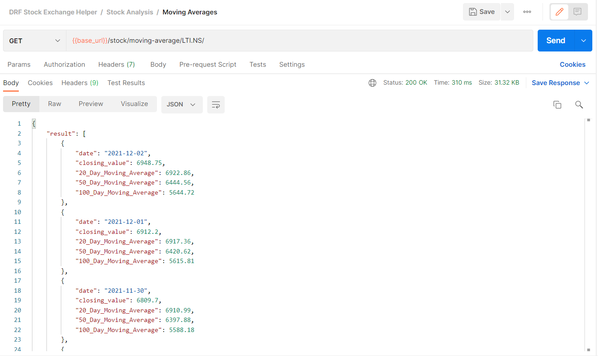

# Stock Exchange Analysis With Django and Raw SQL Query

## Description

This is an API to get stock details and do technical analysis on the derived data

---

## Pre-requisites
At least Python 3.6 installed. 
- [Installation guide on Windows](https://docs.python.org/3.6/using/windows.html)
- [Installation guide on Unix](https://docs.python.org/3.6/using/unix.html)
- [Installation guide on Macintosh](https://docs.python.org/3.6/using/mac.html)

---

## Getting Started

1. Clone the repository using:
    > git clone https://github.com/rroy11705/Rest_API_With_Django

2. It is suggested to use a virtual environment.
- To install virtualenv
    > pip install virtualenv
- To create a virtualenv
    > virtualenv env_name
- To activate virtualenv
    > source env_name/bin/activate (on linux or mac)
    > env_name\Scripts\activate (on windows)

3. Go to console, open cmd with the folder path and install dependencies from _requirements.txt_ file using:
    > pip install -r requirements.txt

4. Make Sure you have MySQL installed and running. 
   You can download MySQL from [MySQL Community Downloads](https://dev.mysql.com/downloads/). For this project we only need MySQL Server and MySQL Workbench.

5. Rename the _.envexample_ file to _.env_ and assign significant values to the environment variables

6. From console run the _run-app.py_ using:
    > python app.py

7. Use Postman to check the endpoints.

---

## Endpoints

#### Stock Details With 1 Day Interval:

http://127.0.0.1:8000/stock/details/LTI.NS/

Output:

#### Moving Averages:

http://127.0.0.1:8000/stock/moving-average/LTI.NS/

Output:

---

## LICENSE

[MIT License](https://github.com/rroy11705/Student-Management-System-Flask/blob/main/LICENSE)
Copyright (c) 2021 Rahul Roy